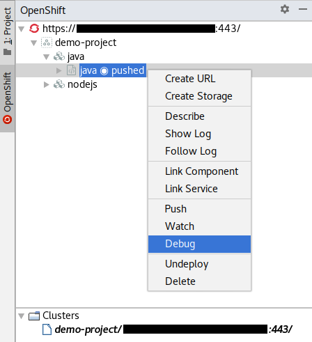
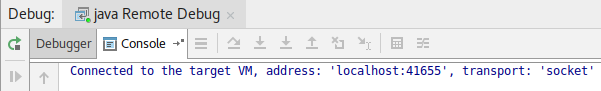
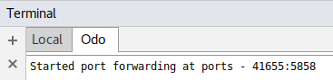
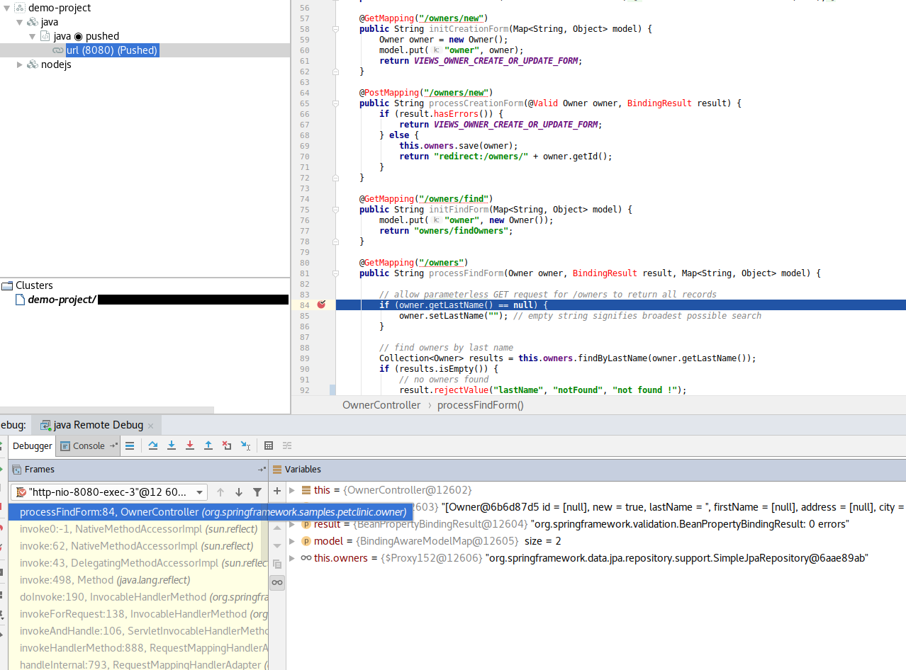
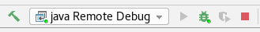

# How to debug a component
This page explains how to debug a component using `odo` and the according actions in IntelliJ.

The `Debug` action is implemented since version `0.2.0`.

## Supported component types and IntelliJ versions
The `Debug` action is actually limited to `Java` and `NodeJS` component types.

Debugging `Java` components is available in IntelliJ Community and Ultimate.
However, to debug `nodejs` components, the `JavaScript Debugger` plugin is required and is only available to licensed versions of IntelliJ (Ultimate, WebStorm).

See [https://www.jetbrains.com/idea/features/editions_comparison_matrix.html](https://www.jetbrains.com/idea/features/editions_comparison_matrix.html)

## Step by Step instructions to debug components

To debug a component, it must be already pushed in the cluster. The debug action is not visible when the component is not pushed or has no context.
When the component is pushed, the `Debug` action is visible only on `Java` and `NodeJS` component types.

When the `Debug` action is selected, an `odo` debug command is run in a terminal, and a `Run Configuration` is launched to connect the according debugger with `odo`, using a random available port.

The `odo` command line displays a message like `Started port forwarding at ports - 41655:5858` where `41655` is the local port used to connect the debugger to `odo` and `5858` is the component port opened in the pod.

For more information about using a different component port, see [https://github.com/openshift/odo/blob/master/docs/proposals/odo-debug.md](https://github.com/openshift/odo/blob/master/docs/proposals/odo-debug.md)

Depending on the component type, the debugger can be either the Java remote debugger or the JavaScript remote debugger.

When a breakpoint set in the source code of the component is hit, the debugger will act as usual: 

You can navigate into the variables, do step by step debugging, ...

## Stop debugging component

You can stop the debugger by using the usual stop buttons or shortcut in IntelliJ. 

Please note that the component is still running on the cluster and `odo` is also still running on the terminal.

## See it in Action !
Below are animations that shows how a debug is performed from the OpenShift view, when a component is already pushed to the cluster.

Java debug: 

Node.js debug: 

## FAQ

### Can i make changes on the component when it is debugging?
**Yes**, you can push any modifications on the cluster while the debugger is running. The local debugger will stop and you need to run the debug configuration again to reconnect to the component. This can take time as the push may rebuild the component.

### Can i launch multiple debugger session in the same time?
**Yes**, if each run configuration uses different local ports, you can debug as many components as you want.
If the debugger is trying to connect to port not available, a message will be displayed.
Also, if you try to run the same configuration twice, a message will be displayed.

### Can i modify run configuration local port setting?
**Yes**, the run configuration settings are used to determine the local port when the `Debug` action is selected.
Also, you can delete the run configuration, a new one will be automatically created when needed.

### How do i stop completely debugging a component?
First stop the debugger, then select the `Terminal` tab. Locate the `odo` debug terminal and right click on it, then select `Close Session`.

### The debugger cannot connect/The debugger does not stop at my breakpoint/How do i see the odo logs?
Select the `Terminal` tab. Locate the `odo` debug terminal and take a look at the messages. 
