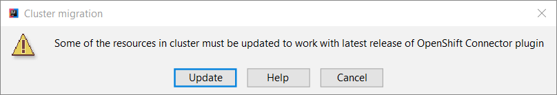
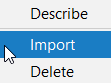

# Migration Guide to v0.1.0 OpenShift Connector

## When migration is required

Migration is required only if you are updating previously installed version of the plugin and have application created with previous version running in your remote or local cluster.

## Why migration is required

This plugin uses OpenShift Do, in short `odo`, CLI tool to create your application and deploy it to OpenShift cluster. Each new release of the plugin uses latest version of `odo` available at the time of release.  Until this new release of OpenShift Connector plugin v0.1.0 `odo` releases it used were backward compatible. It means you would only required to download specific version of `odo` after plugin update to continue your work. This release uses `odo` v1.0.0-beta6 which is not backward compatible with previous releases.

After installing update you will not be able to see previously created applications, components and services in OpenShift Application Explorer window and won't be able to deploy them again until you finish migration.

## Migration steps

Migration consists of three steps:
* Update components and services deployed to cluster to make them visible in OpenShift Application Explorer window.
* Import component's configuration to workspace.
* Undeploy imported components before pushing them to the cluster.

### Update resources in cluster
When new version of plugin accesses cluster first time it checks if there are any components or services deployed using previous version. If any resources created with previous version detected, request for update appears.

> WARNING !!! Backup your cluster resources from all accessible projects before continue

In request for update you have several option to continue:
* `Update` - start migration
* `Help` - read this document, before continue
* `Cancel` - cancel migration and let it appear next time you restart plugin or refresh OpenShift Application Explorer window

Select `Update` option to start migration. During migration only resources with specific labels are updated. Migration will convert old labels to new ones that compatible with odo `v1.0.0-beta6` release. That will make all component and services created with previous version of plugin visible in OpenShift Application Explorer window.

In this plugin release to create and work with Component you need so called 'context' folder, where component's configuration is stored. Depending on context folder presence in current workspace and component deployment status, tree nodes representing components in OpenShift Application Explorer window can have different status description:
* not pushed - you have context folder for component in workspace, but component is not deployed to cluster;
* pushed - you have context folder for component in workspace and component is deployed to cluster;
* no context - you have no context folder for component in workspace and component is deployed to cluster.

### Import component configuration into workspace folder

After update your components and services will appear in OpenShift Application Explorer window with old name and `no context` description, because they are pushed to cluster with previous plugin release and have no context folder associated with them added to workspace yet. Most of commands are not available for component in `no context` state until you import it into workspace using 'Import' command.

### Undeploy components before pushing again

After importing component's configuration into workspace the component changes state from 'no context' to `pushed` and all usual commands like `Push` are available from tree node context menu. When you try to push component's changes for the first time after migration you will see this request to undeploy component from cluster.

This is required step, because new release is not backward compatible and cannot execute `Push` command for the components `pushed` to cluster using previous release of the plugin. Run 'Undeploy' command and push your component to the cluster again to finish migration process.
