# OpenShift Toolkit
[plugin-repo]: https://plugins.jetbrains.com/plugin/12030-openshift-connector-by-red-hat
[plugin-version-svg]: https://img.shields.io/jetbrains/plugin/v/12030-openshift-connector-by-red-hat.svg
[plugin-downloads-svg]: https://img.shields.io/jetbrains/plugin/d/12030-openshift-connector-by-red-hat.svg

[![JetBrains plugins][plugin-version-svg]][plugin-repo]
[![JetBrains plugins][plugin-downloads-svg]][plugin-repo]

## Overview

A JetBrains IntelliJ plugin for interacting with Red Hat OpenShift and Kubernetes clusters. This extension is currently in Preview Mode and supports only Java and Node.js components. We will be supporting other languages in the future releases.

### Running OpenShift Clusters

To run the instance of OpenShift cluster locally, developers can use the following:

* OpenShift 4.x - [CodeReadyContainers](https://console.redhat.com/openshift/create/local)
* Kubernetes 1.x - [minikube](https://minikube.sigs.k8s.io/docs/start/)
* ~~OpenShift 3.x~~ - [minishift](https://github.com/minishift/minishift/releases) / [CDK](https://developers.redhat.com/products/cdk/download/)

The extension also supports OpenShift running on Azure, AWS.

## New features

### Red Hat Developer Sandbox login

Red Hat provides an online OpenShift environment called [Developer Sandbox](https://red.ht/dev-sandbox) that makes it easy for developers to build, test and deploy cloud native applications and microservices.

In order to use Developer Sandbox, you must own a Red Hat SSO account (which can be linked to social accounts like GitHub,…​). Once logged in into Red Hat SSO, you will get an environment provisioned in Developer Sandbox but the first time you will try to login in to Developer Sandbox, your account needs to be verified (in order to prevent crypto miners and robots) thus you need to go through a verification phase where you will be asked to provide:

- first your phone number and country code
- then a verification code that you will receive on your smartphone.

So it is now possible to provision and log in to Developer Sandbox from the OpenShift Toolkit and connect it to the Developer Sandbox environment.

Open the `OpenShift` window (`Window → OpenShift`):

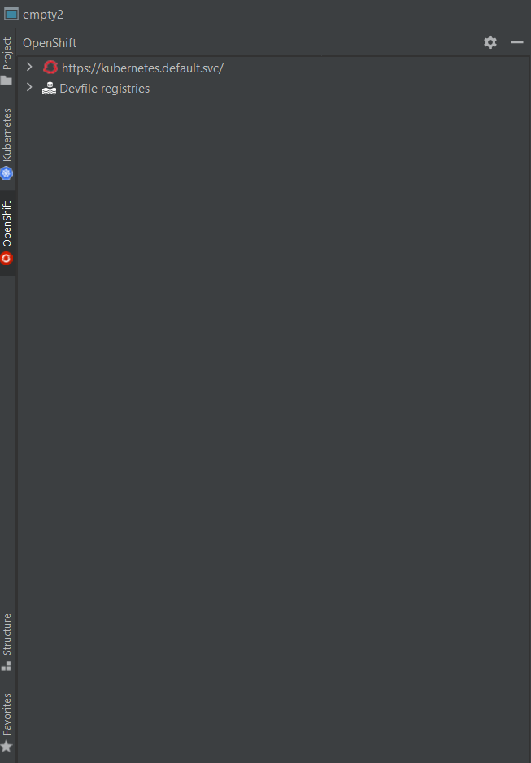

Right click on the first node and select the `Login in to cluster` context menu:

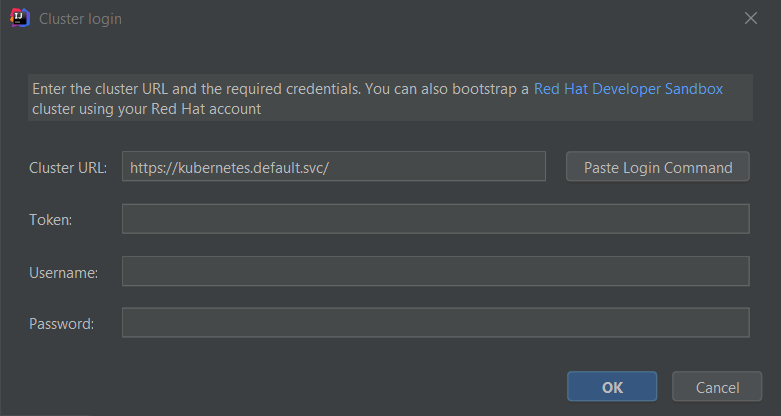

In order to provision the Developer Sandbox environment, click on the `Red Hat Developer Sandbox` link: a browser window will open and you will be required to login to your Red Hat SSO account:

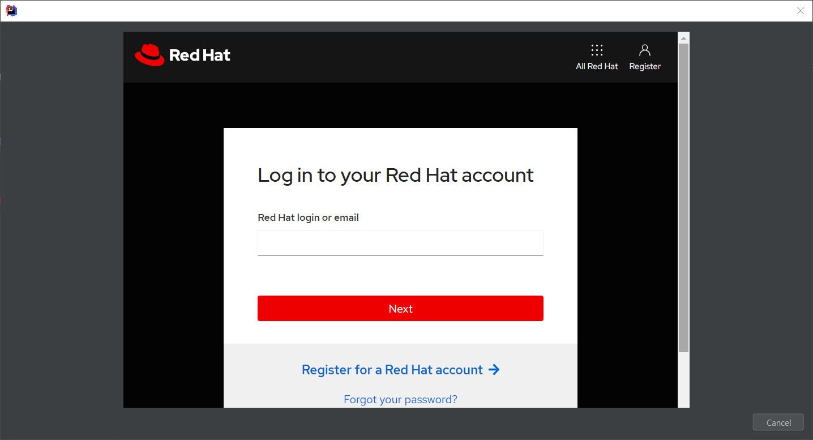

Login to your account (please note that if you don’t have a Red Hat account, you can create a new one). Once you’re logged in, you should see the following window:

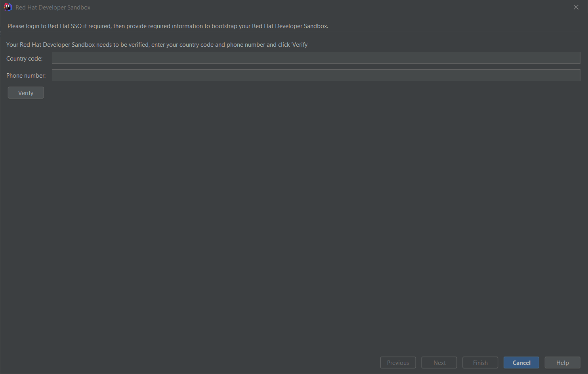

Enter your contry code (+XX) and phone number and click the `Verify` button:

You will be required to provide the verification code that you should have received on your phone:

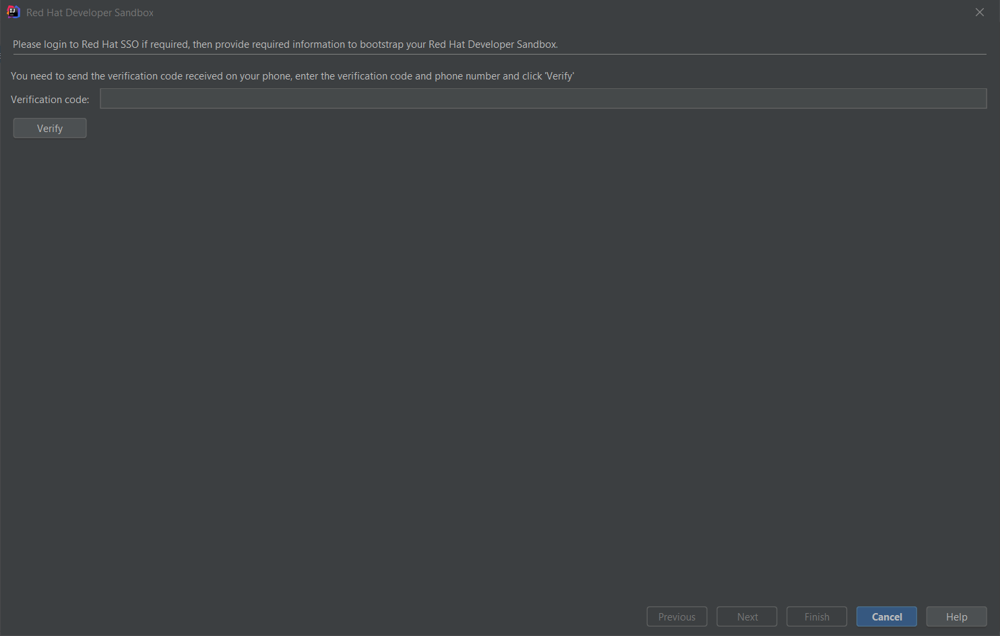

Once your Developer Sandbox environment is provisioned; you will see the following window:

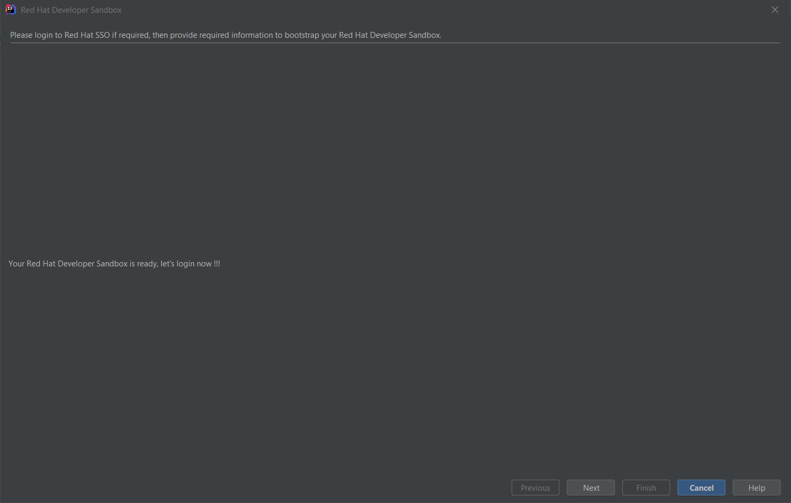

Click on the `Ǹext` button to log in to your Developer Sandbox environment:

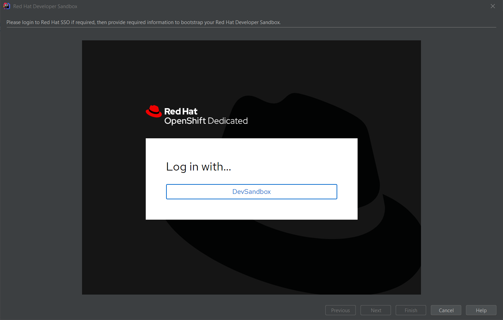

Click on the `DevSandbox` button and log in with the same credentials: you will see the following window:

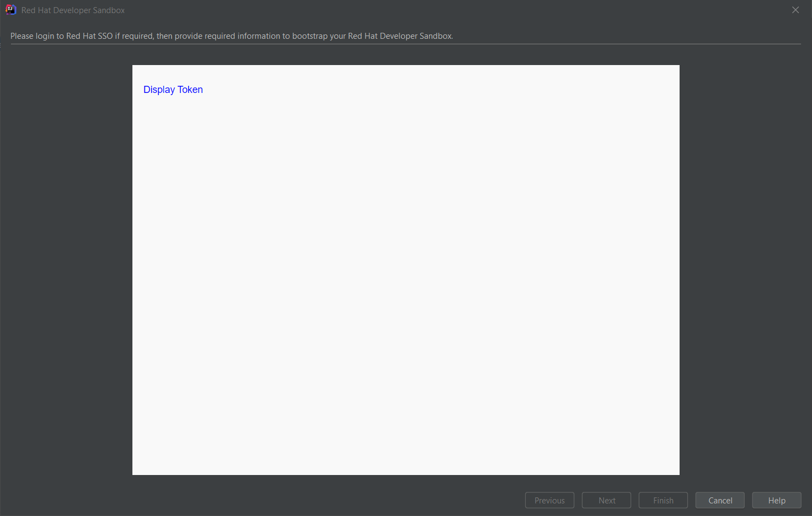

Click on the `Display Token` link and the click on the `Finish` button, you should be back to the `Login` wizard:

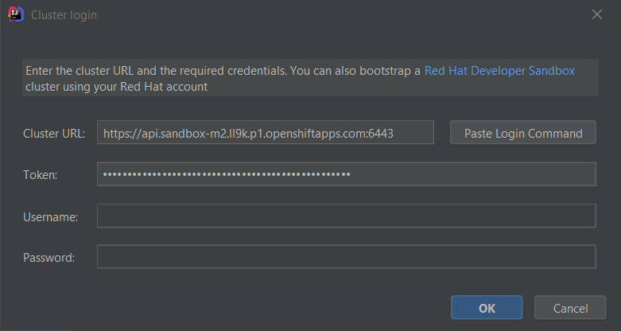

Please note that the `URL` and `Token` fields have been updated. Click the `Finish` button, the `OpenShift` view will be updated with the Developer Sandbox URL and if you expand it, you will see the current namespace available for you to start playing with:

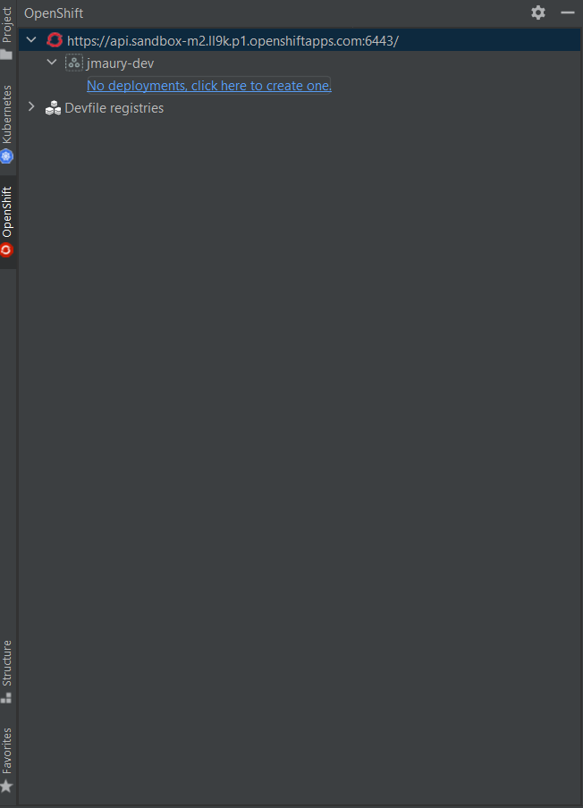

You’re now ready to work against this environment for free !!!.

### Operator based services

When developing cloud native applications on OpenShift, developer may need to launch services (databases, messaging system,…) that the application under development may need to connect to. The OpenShift Toolkit allowed to launch such services but it was based on the service catalog which is not available anymore on OpenShift 4.

The new feature is based on operators which is the devops way of installing and managing software on Kubernetes clusters. So when you want to launch a service for your application, you will have to choose from the list of installed operators on your cluster and then select type of deployment you want.

In the following example, a single operator is installed on our cluster: the [Strimzi](https://strimzi.io) operator for setting up Kafka clusters on Kubernetes.

For each operator, we can select the type of deployment we want to setup. For each type of deployment, specific parameters may be specified. In this example, we decided to set the replicas number to 4 for a Kafka cluster.

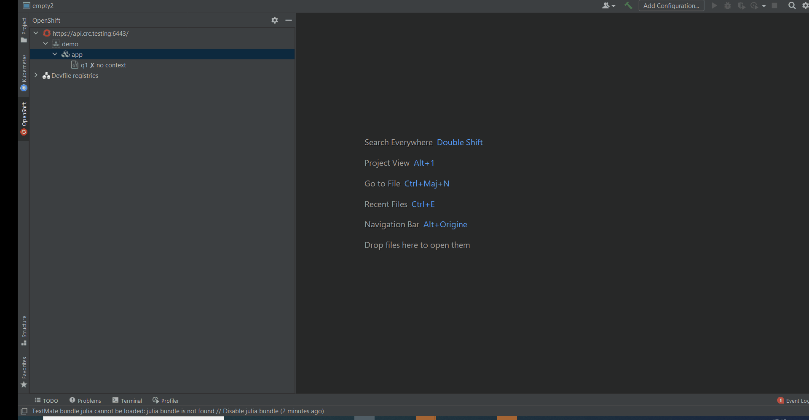

After you’ve entered the name of your service, it will appear in the OpenShift view:

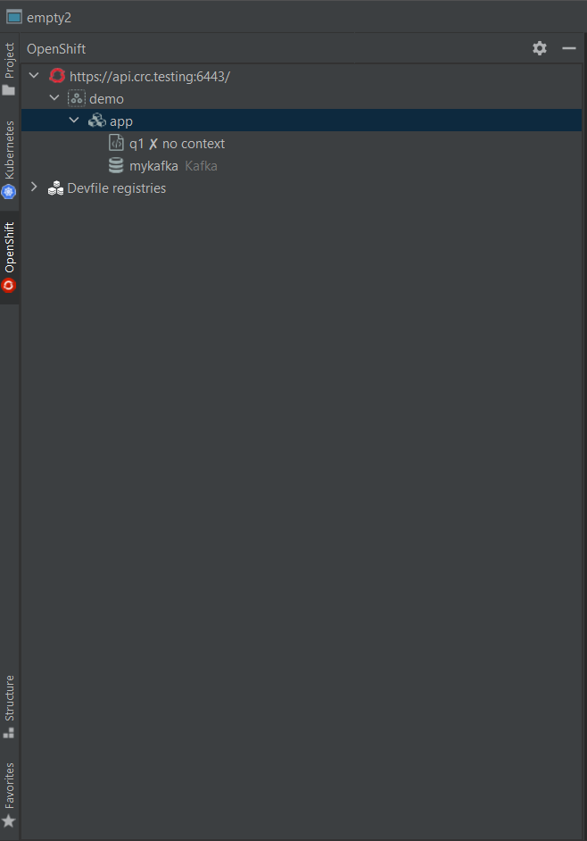

## Features

### Application Explorer focused on current namespace/project

The Application Explorer now display components and services from the current namespace/project. If you want to switch to a different namespace/project, switch to the Kubernetes view and choose the `Use Project` or `Use Namespace` menu:

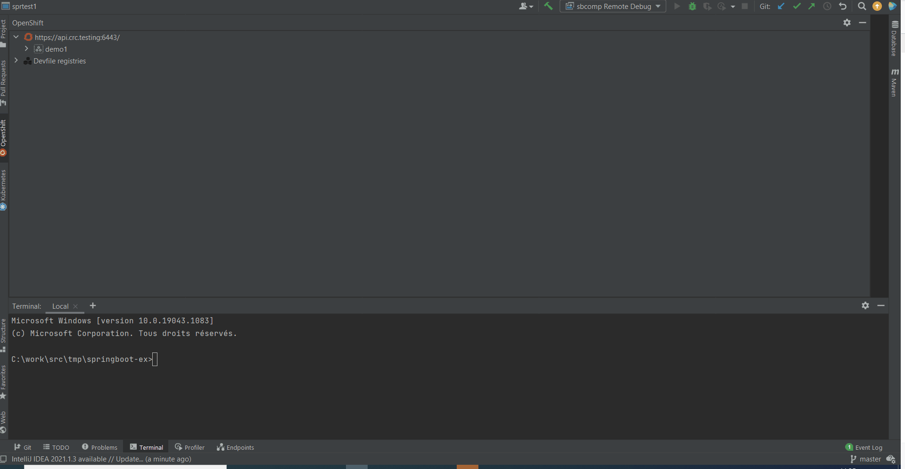

### Simplified create component wizard

When a new component is to be created, a wizard was displayed and the user has to enter several fields before the component could be created. This looks complex for users, so we decided that most of those fields can be automatically computed with default values and user can immediately push the `Finish` button:

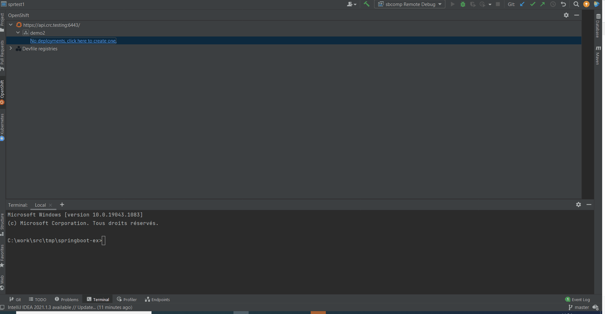

### Devfile registries management

The preferred way of developing components is now based on devfile, which is a YAML file that describe how to build the component and if required, launch other containers with other containers. When you create a component, you need to specify a devfile that describe your component. So either you component source contains its own devfile or you need to pick a devfile that is related to your component. In the second case, OpenShift Toolkit supports devfile registries that contains a set of different devfiles. There is a default registry (https://registry.devfile.io) but you may want to have your own registries. It is now possible to add and remove registries as you want.

The registries are displayed in the OpenShift Application Explorer under the Devfile registries node:

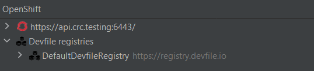

Please note that expanding the registry node will list all devfiles from that registry with a description:

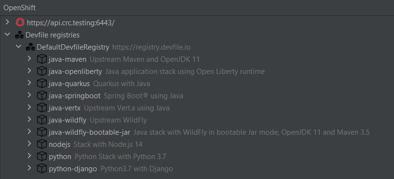

### Integration with the Kubernetes by Red Hat plugin

Connection from the plugin to the cluster is managed through the well known kubeconfig file. in previous versions of this plugin, it was possible to switch between contexts inside this file but the features were very limited. In order to offer a better user experience for Kubernetes developers, all kubeconfig related features have been moved out from this plugin and delegated to the [Kubernetes by Red Hat plugin](https://plugins.jetbrains.com/plugin/15921-kubernetes-by-red-hat).

So the Kubernetes by Red Hat plugin is now a required dependency of this plugin and you can access his features through the Kubernetes window:

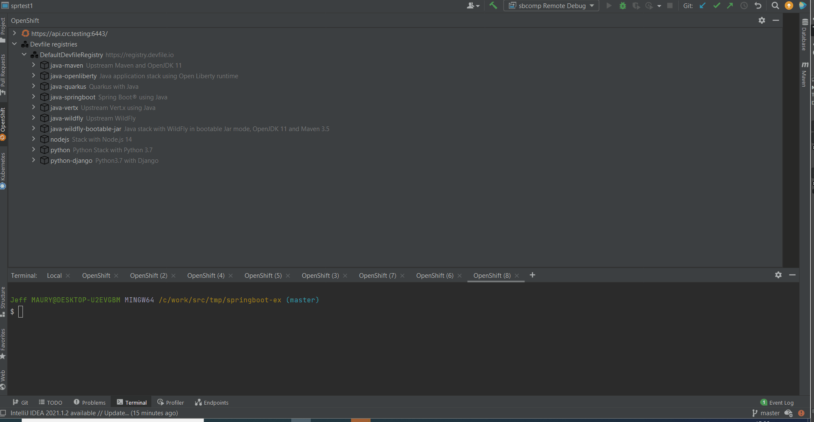

### Improved OpenShift Container Platform 4 compatibility

Although previous versions of the plugin were compatible with OCP 4, there were some small issues that have been fixes (ie paste login command in the Login wizard)

### Telemetry data collection

The plugin collects anonymous usage data, if enabled, and sends it to Red Hat servers to help improve our products and services. 

### Starter projects

When you create a component from a devfile, if the selected devfile contains starter projects (sample projects that contain source code that can be used to bootstrap your component) and if the selected local module is empty, you can optionally select one of those starter projects whose content will be copied to your local module before the component is created.

### Enhanced devfile editing experience

Devfile based components now have a local devfile added to the local module when the component is created. A devfile is a YAML file with a specific syntax. It is now possible for the end user to edit this file (in case specific settings needs to be updated or added).
The YAML editor will now assist during edition of this file with syntax validation and code assist

### Devfile support

The plugin is now based on Odo 2.x, which brings support for Devfiles. A devfile is describing the way your component should be built, rebuilt, debugged. When creating a component, there is now two different choices:

- Pick a devfile from a registry. The registry will contain devfiles specific to your component language, framework and variants (ex Java/Quarkus, Java/SpringBoot, Python/Django,...)
- Your component has its own devfile and the plugin will automatically use it if it's there

For more information about devfiles, see the [devfile docs](https://docs.devfile.io)

## WARNING

### Known issues

When creating a new project, it is possible that the newly created project will not immediately
appear in the Application Explorer tree. This is caused by a synchronization [issue](https://github.com/openshift/odo/issues/4426) in the underlying
CLI tool odo. A workaround is to refresh the tree.

### Breaking Changes

Post `0.1.1` releases contains breaking changes mentioned below.

* The Components created with previous versions(<=0.0.6) will no longer be visible in OpenShift Application Explorer view.
* New Component, Url and Storage objects are created locally in context folder and not immediately pushed to the cluster.

> **Please follow the [migration](https://github.com/redhat-developer/intellij-openshift-connector/wiki/Migration-to-v0.1.0) guide to resolve any possible issues.**

In case of any queries, please use the [Feedback & Question](#Feedback-&-Questions) section.

## Commands and features

`OpenShift Toolkit` supports a number of commands & actions for interacting with OpenShift clusters; these are accessible via the context menu.

### General Commands

* `Log in to cluster` - Log in to your server and save login for subsequent use.
    * Credentials : Log in to the given server with the given credentials.
    * Token : Login using bearer token for authentication to the API server.
* `Log out` - Logs out of the current OpenShift Cluster.
* `List catalog components` - List all available Component Types from OpenShift's Image Builder.
* `List catalog services` - Lists all available Services e.g. mysql-persistent. Only visible if the Service Catalog is enabled on the cluster.
* `New Project` - Create new project inside the OpenShift Cluster.
* `Open Console` - Opens the OpenShift webconsole URL.
* `Refresh`- Refresh the tree with latest resources from the cluster.
* `About` - Provides the information about the OpenShift tools.

#### Actions available for an OpenShift Cluster Project

* `New Component` - Create a new Component from the Project.
    * local - Use a local directory as a source for the Component.
    * git - Use a git repository as the source for the Component.
    * binary - Use a binary file as a source for the Component
* `New Service` - Perform Service Catalog operations when it is enabled.
* `Delete` - Delete an existing Project.

#### Actions available for an Application in a Project

* `New Component` - Create a new Component inside the selected Application.
    * local - Use a local directory as a source for the Component.
    * git - Use a git repository as the source for the Component.
    * binary - Use a binary file as a source for the Component
* `New Service` - Perform Service Catalog operations when it is enabled.
* `Describe` - Describe the given Application in a terminal window.
* `Delete` - Delete an existing Application.

#### Actions available for a Component in an Application

##### Components can be in 3 stages:

      pushed - When the components are deployed into the cluster.
      not pushed - When are the components are in local config but NOT deployed into the cluster.
      no context - When there is no context folder associated with the component in the project.

#### Actions for a Pushed Component

* `New URL` - Expose Component to the outside world. The URLs that are generated using this command, can be used to access the deployed Components from outside the Cluster. Push the component to reflect the changes on the cluster.
* `New Storage` - Create Storage and mount to a Component. Push the component to reflect the changes on the cluster.
* `Describe` - Describe the given Component in a terminal window.
* `Show Log` - Retrieve the log for the given Component.
* `Follow Log` - Follow logs for the given Component.
* `Link Component` - Link Component to another Component.
* `Link Service` - Link Component to a Service.
* `Unlink` - Unlink Component from Component/Service.
* `Open in Browser` - Open the exposed URL in a browser.
* `Push` - Push the source code to a Component.
* `Watch` - Watch for changes, update Component on change. This is not supported for Git based components.
* `Debug` - Connect a local debugger with the Component. See the [wiki](https://github.com/redhat-developer/intellij-openshift-connector/wiki/How-to-debug-a-component) page for more details.
* `Undeploy` - Undeploy a Component from the cluster. The component still resides in the local config.
* `Delete` - Delete an existing Component from the cluster and removes the local config also.

#### Actions for a Not Pushed Component

* `New URL` - Expose Component to the outside world. The URLs that are generated using this command, can be used to access the deployed Components from outside the Cluster.
* `Push` - Push the source code to a Component.
* `Delete` - Delete an existing Component from the local config.

#### Actions for a no context Component

* `Describe` - Describe the given Component in a terminal window.
* `Delete` - Delete an existing Component from the local config.
* `Import` - If the component was created using old version of the extension (`<=0.0.6`), users can use the `Import` action to migrate to the latest version and import the metadata changes.

#### Actions available for a URL in a Component

* `Delete` - Delete a URL from a Component.
* `Open URL` - Click on the icon opens the specific URL in Browser.

#### Actions available for a Storage in a Component

* `Delete` - Delete a Storage from a Component.

#### Actions available for a Service in an Application

* `Describe` - Describe a Service Type for a selected Component
* `Delete` - Delete a Service from an Application

**NOTE:** Currently we support creation of one component per folder. Multiple components from a folder might be supported in future releases.

#### Icons Representation

 Cluster Resource

 Project Resource

 Application Resource

 Component Resource

 Service Resource

 Storage Resource

 URL Resource

 Secure URL Resource

### Dependencies

#### CLI Tools

This extension uses the following CLI tool to interact with OpenShift cluster:

* odo - [odo](https://mirror.openshift.com/pub/openshift-v4/clients/odo/)

> If `odo` tool is located in a directory from `PATH` environment variable it will be used automatically.
The plugin will detect these dependencies and prompt the user to install if they are missing or have not supported version - choose `Download & Install` when you see a notification for the missing tool.

**NOTE:** This plugin is in Preview mode. The extension support for OpenShift is strictly experimental - assumptions may break, commands and behavior may change!

## Release notes

See the [change log][plugin-repo].

Data and Telemetry
==================
The OpenShift plugin collects anonymous [usage data](USAGE_DATA.md) and sends it to Red Hat servers to help improve our products and services. Read our [privacy statement](https://developers.redhat.com/article/tool-data-collection) to learn more. This extension respects the Red Hat Telemetry setting which you can learn more about at [https://github.com/redhat-developer/intellij-redhat-telemetry#telemetry-reporting](https://github.com/redhat-developer/intellij-redhat-telemetry#telemetry-reporting)

Contributing
============
This is an open source project open to anyone. This project welcomes contributions and suggestions!

For information on getting started, refer to the [CONTRIBUTING instructions](CONTRIBUTING.md).

Feedback & Questions
====================
If you discover an issue please file a bug, and we will fix it as soon as possible.
* File a bug in [GitHub Issues](https://github.com/redhat-developer/intellij-openshift-connector/issues).
* Chat with us on [Gitter](https://gitter.im/redhat-developer/openshift-connector).

License
=======
EPL 2.0, See [LICENSE](LICENSE) for more information.