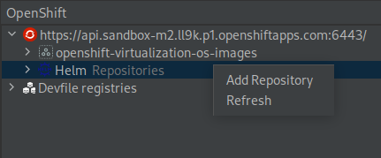
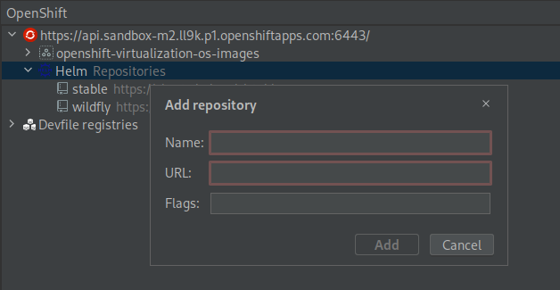
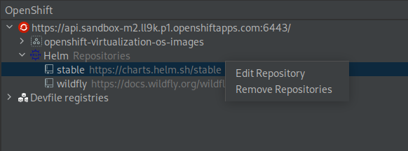
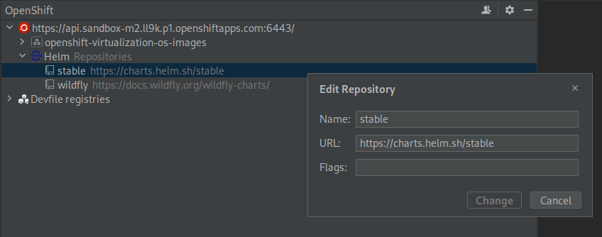
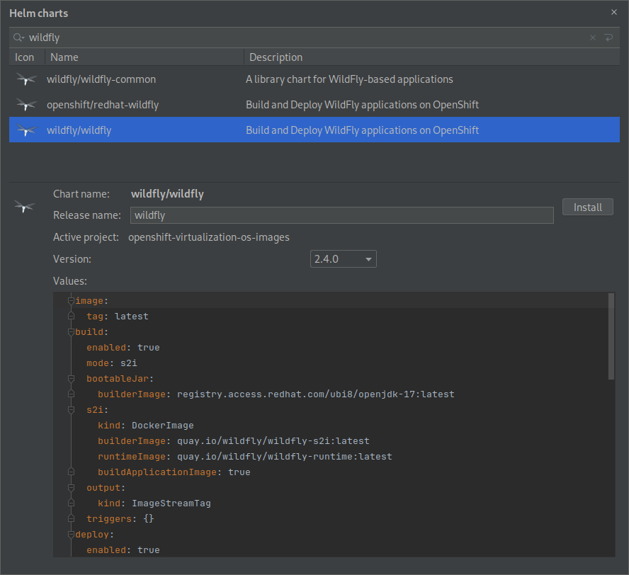
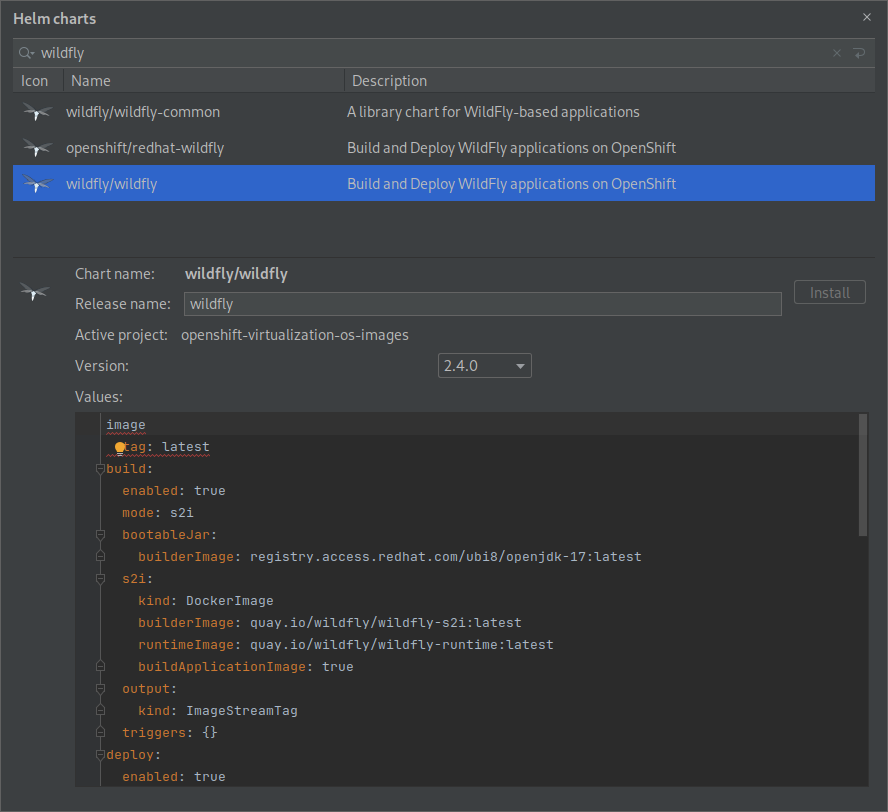
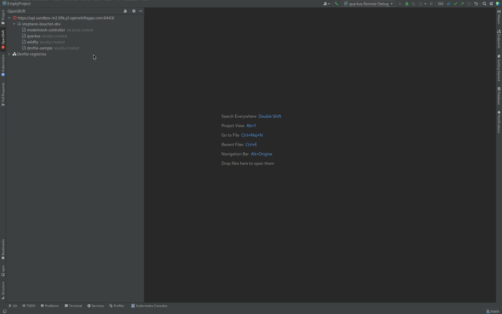
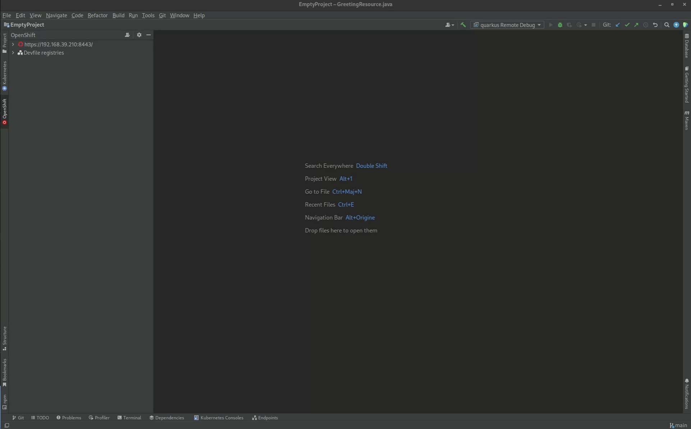

# OpenShift Toolkit
[plugin-repo]: https://plugins.jetbrains.com/plugin/12030-openshift-connector-by-red-hat
[plugin-version-svg]: https://img.shields.io/jetbrains/plugin/v/12030-openshift-connector-by-red-hat.svg
[plugin-downloads-svg]: https://img.shields.io/jetbrains/plugin/d/12030-openshift-connector-by-red-hat.svg

[![JetBrains plugins][plugin-version-svg]][plugin-repo]
[![JetBrains plugins][plugin-downloads-svg]][plugin-repo]

## Overview

A JetBrains IntelliJ plugin for interacting with Red Hat OpenShift and Kubernetes clusters. This extension is currently in Preview Mode and supports only Java and Node.js components. We will be supporting other languages in the future releases.

### Running OpenShift Clusters

To run the instance of OpenShift cluster locally, developers can use the following:

* OpenShift 4.x - [Red Hat OpenShift Local](https://console.redhat.com/openshift/create/local)
* Kubernetes 1.x - [minikube](https://minikube.sigs.k8s.io/docs/start/)

The extension also supports the [Red Hat Developer Sandbox](https://developers.redhat.com/developer-sandbox), OpenShift running on Azure, AWS, and any others supported environments.

## New features

### More actions on Helm Charts

We've added new actions on the Helm Chart node. 

You can now refresh the list of repositories ( if you added a repo using the CLI, for ex.)

You can also add a new repository

You can edit an existing repository

And you can remove a repository.

### Edit Helm charts parameters in YAML style

Now when you're installing a helm chart release, the additional parameters can be edited with a YAML editor with basic validation.

## Features

### Debug is now supported when component is running on Podman

This new improvement enables you to debug your component when using Podman, similar to the debug on Cluster.

### Added Change/Create namespace/project actions in tree

Along with the usage of `namespace` labels when dealing with kubernetes cluster, we added several actions to create or
change current project/namespace.

### Install Helm Charts on the current cluster within the IDE

We're Happy to announce that we've implemented a new action that provides the capability to install
a [Helm](https://helm.sh/) chart into the current cluster.

Below is a small demo of the workflow: installing `kuberos` chart from the Helm stable repo (https://charts.helm.sh/stable) 

There is no need to install anything prior to use Helm. By default, if there is no repository configured, the OpenShift
Helm repository will be used (https://charts.openshift.io/).

For more information about using Helm on OpenShift, please
see [here](https://docs.openshift.com/container-platform/latest/applications/working_with_helm_charts/understanding-helm.html)

### Share your Feedback !

We introduced a new toolbar action within the plugin that enables you to share your feedback with our team. Please feel free to provide your valuable feedback for the plugin workflow.

### Red Hat Developer Sandbox login

Red Hat provides an online OpenShift environment called [Developer Sandbox](https://red.ht/dev-sandbox) that makes it easy for developers to build, test and deploy cloud native applications and microservices.

In order to use Developer Sandbox, you must own a Red Hat SSO account (which can be linked to social accounts like
GitHub,…​). Once logged in into Red Hat SSO, you will get an environment provisioned in Developer Sandbox but the first
time you will try to log in into Developer Sandbox, your account needs to be verified (in order to prevent crypto miners
and robots) thus you need to go through a verification phase where you will be asked to provide:

- first your phone number and country code
- then a verification code that you will receive on your smartphone.

So it is now possible to provision and log in to Developer Sandbox from the OpenShift Toolkit and connect it to the Developer Sandbox environment.

Open the `OpenShift` window (`Window → OpenShift`):

Right-click on the first node and select the `Login in to cluster` context menu:

In order to provision the Developer Sandbox environment, click on the `Red Hat Developer Sandbox` link: a browser window
will open, and you will be required to log in to your Red Hat SSO account:

Login to your account (please note that if you don’t have a Red Hat account, you can create a new one). Once you’re logged in, you should see the following window:

Enter your country code (+XX) and phone number and click the `Verify` button:

You will be required to provide the verification code that you should have received on your phone:

Once your Developer Sandbox environment is provisioned; you will see the following window:

Click on the `Ǹext` button to log in to your Developer Sandbox environment:

Click on the `DevSandbox` button and log in with the same credentials: you will see the following window:

Click on the `Display Token` link and the click on the `Finish` button, you should be back to the `Login` wizard:

Please note that the `URL` and `Token` fields have been updated. Click the `Finish` button, the `OpenShift` view will be updated with the Developer Sandbox URL and if you expand it, you will see the current namespace available for you to start playing with:

You’re now ready to work against this environment for free !!!.

### Operator based services

When developing cloud native applications on OpenShift, developer may need to launch services (databases, messaging
system,…) that the application under development may need to connect to. The OpenShift Toolkit allowed to launch such
services, but it was based on the service catalog which is not available anymore on OpenShift 4.

The new feature is based on operators which is the devops way of installing and managing software on Kubernetes clusters. So when you want to launch a service for your application, you will have to choose from the list of installed operators on your cluster and then select type of deployment you want.

In the following example, a single operator is installed on our cluster: the [Strimzi](https://strimzi.io) operator for setting up Kafka clusters on Kubernetes.

For each operator, we can select the type of deployment we want to set up. For each type of deployment, specific
parameters may be specified. In this example, we decided to set the replicas number to 4 for a Kafka cluster.

After you’ve entered the name of your service, it will appear in the OpenShift view:

### Application Explorer focused on current namespace/project

The Application Explorer now display components and services from the current namespace/project. If you want to switch to a different namespace/project, switch to the Kubernetes view and choose the `Use Project` or `Use Namespace` menu:

### Simplified create component wizard

When a new component is to be created, a wizard was displayed and the user has to enter several fields before the component could be created. This looks complex for users, so we decided that most of those fields can be automatically computed with default values and user can immediately push the `Finish` button:

### Devfile registries management

The preferred way of developing components is now based on devfile, which is a YAML file that describe how to build the
component and if required, launch other containers with other containers. When you create a component, you need to
specify a devfile that describe your component. So either your component source contains its own devfile or you need to
pick a devfile that is related to your component. In the second case, OpenShift Toolkit supports devfile registries that
contains a set of different devfiles. There is a default registry (https://registry.devfile.io) but you may want to have
your own registries. It is now possible to add and remove registries as you want.

The registries are displayed in the OpenShift Application Explorer under the Devfile registries node:

Please note that expanding the registry node will list all devfiles from that registry with a description:

### Integration with the Kubernetes by Red Hat plugin

Connection from the plugin to the cluster is managed through the well known kubeconfig file. In previous versions of this plugin, it was possible to switch between contexts inside this file but the features were very limited. In order to offer a better user experience for Kubernetes developers, all kubeconfig related features have been moved out from this plugin and delegated to the [Kubernetes by Red Hat plugin](https://plugins.jetbrains.com/plugin/15921-kubernetes-by-red-hat).

So the Kubernetes by Red Hat plugin is now a required dependency of this plugin, and you can access his features through
the Kubernetes window:

### Improved OpenShift Container Platform 4 compatibility

Although previous versions of the plugin were compatible with OCP 4, there were some small issues that have been fixes (ie paste login command in the Login wizard)

### Telemetry data collection

The plugin collects anonymous usage data, if enabled, and sends it to Red Hat servers to help improve our products and services. 

### Starter projects

When you create a component from a devfile, if the selected devfile contains starter projects (sample projects that contain source code that can be used to bootstrap your component) and if the selected local module is empty, you can optionally select one of those starter projects whose content will be copied to your local module before the component is created.

### Enhanced devfile editing experience

Devfile based components now have a local devfile added to the local module when the component is created. A devfile is a YAML file with a specific syntax. It is now possible for the end user to edit this file (in case specific settings needs to be updated or added).
The YAML editor will now assist during edition of this file with syntax validation and code assist.

### Devfile support

The plugin is now based on [Odo](https://odo.dev), which brings support for Devfiles. A devfile is describing the way your component should be built, rebuilt, debugged. When creating a component, there is now two different choices:

- Pick a devfile from a registry. The registry will contain devfiles specific to your component language, framework and variants (ex Java/Quarkus, Java/SpringBoot, Python/Django,...)
- Your component has its own devfile and the plugin will automatically use it if it's there

For more information about devfiles, see the [devfile docs](https://docs.devfile.io)

## WARNING

### Breaking Changes

Post `1.0.0` releases contains breaking changes mentioned below.

* The Components created with previous versions(<=1.0.0) will be automatically migrated to use odo v3 workflow.

> **Please follow the [migration](https://github.com/redhat-developer/intellij-openshift-connector/wiki/Migration-to-v0.1.0) guide to resolve any possible issues for older breaking changes.**

In case of any queries, please use the [Feedback & Question](#feedback--questions) section.

## Commands and features

`OpenShift Toolkit` supports a number of commands & actions for interacting with OpenShift/Kubernetes clusters; these are accessible via the context menu.

### General Commands

* `Log in to cluster` - Log in to your cluster and save login for subsequent use.
    * Credentials : Log in to the given cluster with the given credentials.
    * Token : Login using bearer token for authentication to the API server.
* `New Project`/`New Namespace` - Create new project inside the OpenShift cluster / Create new namespace inside the
  Kubernetes cluster.
* `Change Project`/`Change Namespace` - Select a new project inside the OpenShift cluster / Select a new namespace
  inside the Kubernetes cluster.
* `Open Console Dashboard` - Opens the OpenShift webconsole URL.
* `Refresh`- Refresh the tree with the latest resources from the cluster.
* `Getting Started` - Open the Getting Started tour.
* `About` - Provides the information about the tools used.

#### Actions available for a Cluster Project/Namespace

* `Change Project`/`Change Namespace` - Select a new project inside the OpenShift cluster / Select a new namespace
  inside the Kubernetes cluster.
* `New Component` - Create locally a new Component.
* `New Service` - Perform Service Catalog operations when it is enabled in the cluster. The created service can then be
  linked to a component.
* `Delete Project`/`Delete Namespace` - Delete an existing Project/Namespace.
* `Install Helm Charts` - Open a dialog to install a Helm Chart inside the current project/namespace.

WARNING: Use the above delete action will perform the same delete action as in the cluster. That means all resources tied to that project/namespace will be also deleted (ie secrets, configMaps,...)  

#### Actions available for a Component

##### Components can be in 5 stages:

      no local context - When the component is present into the cluster but not in local config.
      locally created  - When the component is in local config but NOT pushed/deployed into the cluster.
      dev              - When the component is pushed into the cluster in dev mode, that is every changes are synced and when terminating the command, the component will be deleted from the cluster.
      debug            - When the component is pushed into the cluster in debug mode, same as dev mode plus the ability to put breakpoints in the code and use the debugger.
      deploy           - When the component is deployed into the cluster.

#### Common Actions

* `Describe` - Describe the given component in a terminal window.
* `Link Service` - Link the component to an existing service in the cluster. That will create a binding from the component to the service.
* `Delete` - Delete an existing component from the local config.

#### Actions for a locally created component

* `Start dev on Cluster` - Push the local component in the cluster inside the project/namespace in dev mode.
* `Start dev on Podman` - Push the local component in local Podman in dev mode.

#### Actions for a pushed component (Dev/Debug)

* `Stop dev on Cluster` - Stop the dev mode and delete the component from the cluster.
* `Stop dev on Podman` - Stop the dev mode and delete the component from Podman.
* `Debug` - Connect a local debugger to the Component. See the [wiki](https://github.com/redhat-developer/intellij-openshift-connector/wiki/How-to-debug-a-component) page for more details.
* `Show Log` - Retrieve the log for the given Component.
* `Follow Log` - Follow logs for the given Component.

#### Actions available for a URL in a Component

* `Open in Browser` - Open the exposed URL in a browser.
  ** NOTE ** URLs are exposed only when the component is in dev mode or deployed in the cluster. The URL definitions are
  stored in the devfile file.

#### Actions available for a Service in a project/namespace

* `Delete` - Delete the Service from the project/namespace.

#### Actions available for a binding in a component

* `Show binding information` - Show the binding information a dialog.
* `Delete` - Delete the binding from the component.

#### Actions available for a Helm Release in a project/namespace

* `Uninstall` - Uninstall the Helm release from the project/namespace.

#### Icons Representation

##### Cluster tree

 Cluster Resource

 Project Resource

 Component Resource

 Helm Release Resource

 Service Resource

 URL Resource

##### Devfile registry tree

 Registry Resource

 Component Type Resource

 Starter Resource

### Dependencies

#### CLI Tools

This extension uses the following CLI tool to interact with OpenShift cluster:

* odo - [odo](https://mirror.openshift.com/pub/openshift-v4/clients/odo/)
* oc - [oc](https://mirror.openshift.com/pub/openshift-v4/clients/ocp/)
* helm - [helm](https://mirror.openshift.com/pub/openshift-v4/clients/helm/)

> If any of the above tool is located in a directory from `PATH` environment variable it will be used automatically. Warning, if the desired version is incompatible with the one found in PATH, the tooling will download automatically a compatible version. 
> The plugin will detect these dependencies and prompt the user to install if they are missing or have not supported version - choose `Download & Install` when you see a notification for the missing tool.

**NOTE:** This plugin is in Preview mode. The extension support for OpenShift is strictly experimental - assumptions may break, commands and behavior may change!

## Release notes

See the [change log][plugin-repo].

Data and Telemetry
==================
The OpenShift plugin collects anonymous [usage data](USAGE_DATA.md) and sends it to Red Hat servers to help improve our products and services. Read our [privacy statement](https://developers.redhat.com/article/tool-data-collection) to learn more. This extension respects the Red Hat Telemetry setting which you can learn more about at [https://github.com/redhat-developer/intellij-redhat-telemetry#telemetry-reporting](https://github.com/redhat-developer/intellij-redhat-telemetry#telemetry-reporting)

Contributing
============
This is an open source project open to anyone. This project welcomes contributions and suggestions!

For information on getting started, refer to the [CONTRIBUTING instructions](CONTRIBUTING.md).

Feedback & Questions
====================
If you discover an issue please file a bug, and we will fix it as soon as possible.
* File a bug in [GitHub Issues](https://github.com/redhat-developer/intellij-openshift-connector/issues).
* Chat with us on [Gitter](https://gitter.im/redhat-developer/openshift-connector).

License
=======
EPL 2.0, See [LICENSE](LICENSE) for more information.
